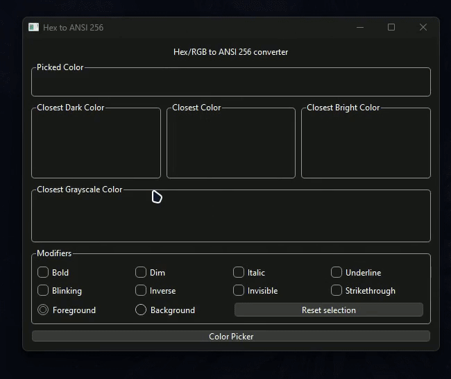

## PyQt6 Hex to ANSI

A simple Hex Color to ANSI Code equivalent color, written in Python using PyQt6.

  

### Features

- Color Picker
- Closest ANSI code to the selected color
  - Code in the '5' pattern, the 256 ANSI
  - Code in the '2' pattern, the RGB ANSI
- Closest Dark and Light color to the selected color
- Closest Grayscale color to the selected color
- Modifiers for the selected color
  - Color modifiers:
    - Foreground
    - Background
  - Text modifiers:
    - Bold
    - Dim
    - Italic
    - Underline
    - Blinking
    - Inverse
    - Invisible/Hidden
    - Strikethrough

### Screenshots

GUI in its initial state

Color Picker

GUI with a color selected

GUI with a color selected and modifiers

The logic behind the conversion is based on the one used [here][credits].

<!-- URLS -->

[credits]: https://www.hackitu.de/termcolor256/
